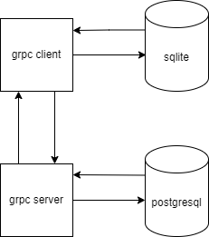

# gophkeeper

TODO: покрытие кода тестами  
TODO: исправить дешифровку данных 0_0  

in the CardData form the card number is checked by the Luhn algorithm  
in the BinaryData form you need to enter file path and maximum file size up to 1gb  

**users**                       
| user_id | login | password | last_update_at | metainfo |
|---------|-------|----------|----------------|----------|
| PRIMARY KEY INT| BYTEA | BYTEA | TIMESTAMPTZ | BYTEA |

**textdata**                                                
| text_data_id | user_id | unique_key | text_data | uploaded_at | metainfo |
|--------------|---------|------------|-----------|-------------|----------|
| PRIMARY KEY INT | INT FOREIGN KEY (user_id) REFERENCES users(user_id) ON DELETE CASCADE | varchar(128) | BYTEA | TIMESTAMPTZ | BYTEA |

**binarydata**                                               
| binary_data_id | user_id | unique_key | binary_data| uploaded_at | metainfo |                                
|----------------|---------|------------|------------|-------------|----------|                  
| PRIMARY KEY INT | INT FOREIGN KEY (user_id) REFERENCES users(user_id) ON DELETE CASCADE | varchar(128) | BYTEA | TIMESTAMPTZ | BYTEA |

**carddata**
| card_data_id | user_id | unique_key | card_number | card_name | card_date | cvv | uploaded_at | metainfo |
|--------------|---------|------------|-------------|-----------|-----------|-----|-------------|----------|
| PRIMARY KEY INT | INT FOREIGN KEY (user_id) REFERENCES users(user_id) ON DELETE CASCADE | varchar(128) | BYTEA | BYTEA | BYTEA | BYTEA | TIMESTAMPTZ | BYTEA |
 